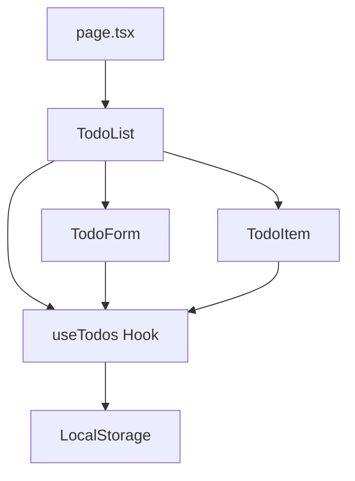

# 設計書

## 概要

Next.js 14のApp Routerを使用したTODOアプリケーションを構築します。React Server ComponentsとClient Componentsを適切に使い分け、TypeScriptで型安全性を確保します。状態管理にはReact Hooksを使用し、データの永続化にはブラウザのローカルストレージを利用します。

## アーキテクチャ

### 技術スタック

- **フレームワーク**: Next.js 14 (App Router)
- **言語**: TypeScript
- **UIライブラリ**: shadcn/ui
- **スタイリング**: Tailwind CSS
- **状態管理**: React Hooks (useState, useEffect)
- **データ永続化**: ブラウザのローカルストレージ

### ディレクトリ構造

```
src/
├── app/
│   ├── layout.tsx          # ルートレイアウト
│   ├── page.tsx            # メインページ
│   └── globals.css         # グローバルスタイル
├── components/
│   ├── TodoList.tsx        # タスクリストコンポーネント
│   ├── TodoItem.tsx        # 個別タスクコンポーネント
│   └── TodoForm.tsx        # タスク作成フォーム
├── types/
│   └── todo.ts             # 型定義
└── hooks/
    └── useTodos.ts         # タスク管理カスタムフック
```

## コンポーネントとインターフェース

### データモデル

```typescript
interface Todo {
  id: string;
  title: string;
  completed: boolean;
  createdAt: number;
}
```

### コンポーネント設計

#### 1. page.tsx (Server Component)
- ルートページコンポーネント
- TodoListコンポーネントをレンダリング

#### 2. TodoList.tsx (Client Component)
- タスクの状態管理を担当
- useTodosカスタムフックを使用
- TodoFormとTodoItemコンポーネントを統合
- 空のリスト時のメッセージ表示

#### 3. TodoForm.tsx (Client Component)
- タスク作成フォーム
- 入力バリデーション（空文字チェック）
- 作成後の入力フィールドクリア

#### 4. TodoItem.tsx (Client Component)
- 個別タスクの表示と操作
- 完了状態の切り替え
- 編集モード（ダブルクリック）
- 削除機能
- Esc/Enterキーのハンドリング

#### 5. useTodos.ts (カスタムフック)
- タスクの状態管理
- CRUD操作の実装
- ローカルストレージとの同期

**提供する関数:**
- `addTodo(title: string): void`
- `toggleTodo(id: string): void`
- `deleteTodo(id: string): void`
- `updateTodo(id: string, title: string): void`

## データフロー



1. ページ読み込み時、useTodosフックがローカルストレージからデータを読み込む
2. ユーザーの操作（作成、更新、削除、完了切り替え）がuseTodosフックの関数を呼び出す
3. useTodosフックが状態を更新し、ローカルストレージに保存
4. 状態の変更がコンポーネントに反映される

## データモデル

### Todo型

```typescript
interface Todo {
  id: string;           // UUID v4形式の一意識別子
  title: string;        // タスクのタイトル（1文字以上）
  completed: boolean;   // 完了状態
  createdAt: number;    // 作成日時（Unixタイムスタンプ）
}
```

### ローカルストレージ

- **キー**: `todos`
- **値**: JSON文字列化されたTodo配列
- **初期値**: 空配列 `[]`

## エラーハンドリング

### バリデーション

1. **タスク作成時**
   - 空文字列のチェック
   - トリム後の文字列長が0の場合は作成を防止

2. **タスク更新時**
   - 空文字列のチェック
   - トリム後の文字列長が0の場合は更新を防止し、元の値を保持

### ローカルストレージエラー

- JSON.parseエラー時は空配列にフォールバック
- ストレージ容量超過時はコンソールにエラーログを出力

## テスト戦略

### 単体テスト対象

1. **useTodosフック**
   - タスクの追加、更新、削除、完了切り替えの動作
   - ローカルストレージへの保存と読み込み

2. **コンポーネント**
   - TodoForm: 入力バリデーション、フォーム送信
   - TodoItem: 編集モード切り替え、キーボード操作
   - TodoList: 空リスト時の表示

### 統合テスト

- ユーザーフローのエンドツーエンドテスト
  - タスクの作成から削除までの一連の操作
  - ページリロード後のデータ永続化確認

## UI/UXデザイン

### レイアウト

- 中央寄せのシンプルなレイアウト
- 最大幅800pxのコンテナ
- レスポンシブデザイン（モバイル対応）

### shadcn/uiコンポーネント

以下のshadcn/uiコンポーネントを使用：

- **Button**: タスクの削除ボタン、作成ボタン
- **Input**: タスクのタイトル入力、編集時の入力
- **Checkbox**: タスクの完了状態切り替え
- **Card**: タスクアイテムのコンテナ

### スタイリング

- **未完了タスク**: 通常のテキスト表示
- **完了済みタスク**: 取り消し線、薄いグレー色
- **編集モード**: 入力フィールドに切り替え、フォーカス
- **ホバー効果**: ボタンとタスクアイテムに視覚的フィードバック
- shadcn/uiのデフォルトテーマを使用

### アクセシビリティ

- セマンティックHTML要素の使用
- キーボード操作のサポート（Enter、Esc）
- 適切なaria-label属性の設定
- shadcn/uiコンポーネントの組み込みアクセシビリティ機能を活用
